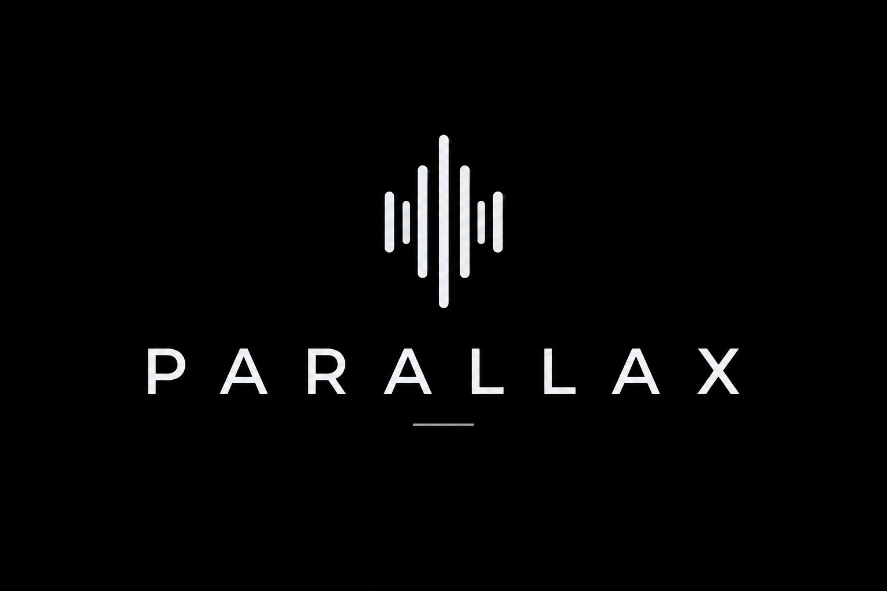

# Symphony Parallax™ Releases

Public documentation and release repository for Symphony Parallax™, the cloud-scale consensus orchestration product in the K Means AI Symphony suite.

Parallax extends the Symphony approach **from the console to the cloud**. Symphony Maestro provides a local, terminal-driven workflow for multi-model collaboration. Parallax brings the same family of ideas into durable cloud infrastructure: queue-driven operation dispatch, tenant-aware status tracking, model orchestration, traceable results, and scalable processor execution.

Use Parallax when you need multiple independent model perspectives, an integrator-driven final answer, repeatable consensus workflows, and cloud operations that can be dispatched, tracked, retried, and scaled.

Learn more at [kmeans.ai](https://kmeans.ai).

## License Notice

Symphony Parallax™ is proprietary software.

Copyright (C) K MEANS AI LLC. All rights reserved.

Release artifacts in this repository are provided for evaluation and use according to the terms supplied by K MEANS AI LLC. No source-code license is granted.

## What Parallax Does

Parallax coordinates multi-model reasoning jobs in the cloud. A client submits an operation, Parallax routes that work through cloud infrastructure, model participants produce responses according to the selected execution mode, and an integrator model produces or confirms the final answer.

The system is designed for workloads where a single model response is not enough:

- high-stakes analysis and review
- policy or strategy exploration
- product and technical decision support
- research synthesis
- comparative reasoning
- validation of generated answers
- workflows that benefit from traceable multi-model perspective

## Execution Modes

Parallax supports three execution modes.

### Sequential Bridge

`SequentialBridge` is the default Linguistic Bridge mode.

Reasoners are called sequentially inside each round. Each model can receive the shared context produced by earlier participants before contributing its own response. This mode is best when the task benefits from deliberation, critique, refinement, and conversational continuity.

Use it for deep consensus work.

### One-Shot Synthesis

`OneShotSynthesis` sends the same prompt to all active reasoners in parallel. The integrator receives the independent responses and synthesizes them into one complete answer.

This mode is faster than Sequential Bridge and is useful when breadth, coverage, or independent drafting matters more than multi-round deliberation.

Use it for fast synthesis.

### One-Shot Confirmation

`OneShotConfirmation` sends the same prompt to all active reasoners in parallel, then asks the integrator to compare their responses against a configured consensus threshold.

If the threshold is met, Parallax returns a final answer. If the threshold is not met, Parallax reports that confirmation failed instead of presenting the result as consensus.

Use it for fast validation.

## Signaling And Traceability

Parallax captures lightweight participant signals during orchestration. Signals summarize whether model participants completed their work, aligned with the emerging result, or could not confidently proceed. This gives operators a compact view of how the consensus process evolved without requiring full access to raw model responses.

Signals appear in operation status and trace metadata alongside state, confidence, timing, and result information. They are especially useful for cloud operations because they help distinguish a successful consensus, a failed confirmation, and a prompt that could not be interpreted reliably.

Publicly, the important idea is simple: Parallax does more than collect several model answers. It tracks the state of the collaboration so the final result can be reviewed, audited, and operated at scale.

## How It Fits With Symphony

Symphony has two complementary paths:

- **Maestro**: local, console-first multi-model collaboration.
- **Parallax**: cloud-scale consensus orchestration.

Together, they express the same idea at different scales: local operator control when you want a hands-on console workflow, and distributed cloud execution when you need durable, scalable, trackable operations.

## Typical Cloud Flow

1. A client creates an operation with a tenant id, persona, prompt, interaction mode, and execution mode.
2. Parallax dispatches the operation to cloud infrastructure.
3. A processor acquires the work and runs the selected orchestration mode.
4. Reasoner models produce independent or sequentially contextual responses.
5. An integrator model synthesizes or confirms the final answer.
6. The operation status is updated with state, confidence, timing, signals, and trace metadata.
7. Clients read the final status using the operation receipt.

## Public Release Artifacts

When public Parallax release artifacts are published, they may include items such as:

```text
parallax-processor container image metadata
deployment templates
configuration samples
checksums
release notes
public documentation
```

Use the GitHub Releases page for versioned downloads when artifacts are available.

## Configuration Principles

Parallax is designed to work with OpenAI-compatible model endpoints and cloud-native identity patterns. Production configuration should follow these principles:

- Store credentials outside source-controlled files.
- Prefer environment variables, managed identity, or a secure secret store.
- Keep prompt templates under release control because they shape orchestration behavior.
- Configure model participants deliberately: at least two reasoners and one integrator are required for consensus workflows.
- Treat traces and generated outputs as potentially sensitive application data.

## Security And Data Handling

Parallax may process prompts, uploaded files, model responses, trace metadata, and final outputs. These may contain sensitive information depending on how the system is configured and used.

Recommended controls:

- Use managed identity or equivalent cloud identity where available.
- Avoid embedding provider keys in configuration files.
- Scope operation data by tenant and operation id.
- Apply retention policies to status and trace data.
- Restrict access to storage, queues, status records, logs, and monitoring.
- Review model-provider data policies before sending sensitive material.

## Operational Notes

Parallax is intended for cloud-scale, multi-model consensus workflows. The right execution mode depends on the task:

- Choose `SequentialBridge` when the reasoning process itself matters.
- Choose `OneShotSynthesis` when speed and coverage matter.
- Choose `OneShotConfirmation` when independent validation matters.

For production use, validate each configured model provider, orchestration persona, and execution mode in a non-production environment before scaling traffic.

## Release Status

This repository is the public release and documentation home for Symphony Parallax. Source code is maintained separately. Public artifacts, release notes, and checksums will appear here as they become available.
